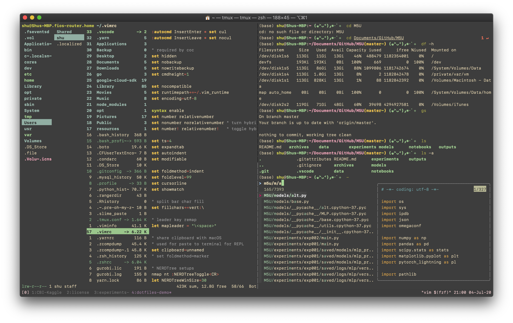

# Shu’s dotfiles ･ﾟ(๑˃ᴗ˂)ﻭ･ﾟ✧

**Extremely Lightweight Personal Devtool Backpack!**

## Repertoire
This customized set includes configs \& themes for:
- **shell-related**: bash, zsh, oh-my-zsh, tmux, cmus
- **editor-related**: vim, vundle, code-server
- **dev-related**: git, ipython, jupyter (vim-jupyter)
- **file manager and monitor**: ranger, htop
- **remappers:** karabiner, autohotkey, HHKB-YD binary
- Inspired and powered by [dotbot](https://github.com/anishathalye/dotbot) and [gruvbox](https://github.com/morhetz/gruvbox)

## Usage
The goal is to minimize the effort required for setting up and managing the personal system environment:
- **location:** `git clone` this repo anywhere in a (fresh) Linux/macOS system 
- **tool installation:** `sudo apt-get install ranger zsh curl git vim exuberant-ctags fzf`
- **oh-my-zsh:** `sh -c "$(curl -fsSL https://raw.github.com/ohmyzsh/ohmyzsh/master/tools/install.sh)"`
- **repo root:**  `sh rock`, it will take care of all registered git submodules, when transitioning git repo, see below
- **vim plugins and coc**: `:PluginInstall; :CocInstall coc-python`
- **enjoy!**

## Transition
Git submodules (dotbot and vim/zsh plugins) should be handled carefully during repo transition:
- **dotbot**: `git submodule add https://github.com/anishathalye/dotbot dotbot`
- **Vundle.vim**: `git submodule add https://github.com/VundleVim/Vundle.vim editor/vim/bundle/Vundle.vim`

