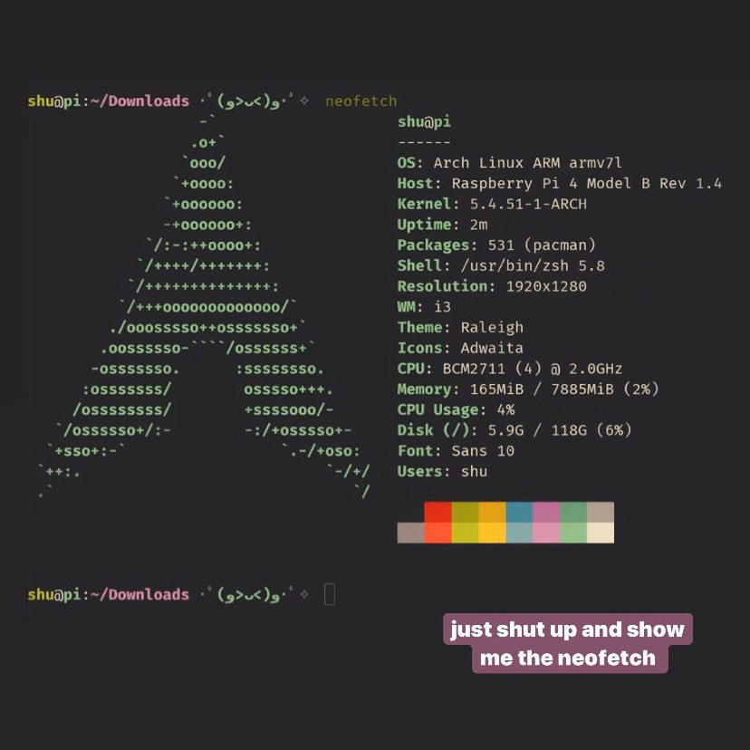

# Get-Ready-with-Me! 🤩

**Sync fast and live the immortal \& elegant GNU/Linux lifestyle!**  
***@debian @arch @vim @i3wm @zsh @xfce4-term @vscode @hhkb***  
Scripts and dotfiles for setting up and managing a custom system environment.  

*v1.2 (July 31, 2020): Overclocked Pi 4B + Arch Linux/Manjaro KDE/PiOS + i3wm.*  
*v1.1 (July 22, 2020): MacBook Pro A1502 + Pop!_OS 20.04 LTS + i3wm/GNOME3.*  
*v1.0 (July 15, 2020): SOP works out-of-the-box and takes <20m.*

## TODO

Priorities are shown as below:
- LAMP infrastructure
- DAW (bitwig), MIDI, audio interface, and electric guitar support, lilypond
- Auto-adjust screen resolution and dpi after login

## Repertoire

This customized set includes two parts: 
- **Rock**: Shell scripts for core toolkit and env installation
- **Roll**: Dotfiles applying personal configs \& themes for:
  - **editor-related**: vim, vundle, ycmd, etc.
  - **file manager and monitor**: ranger, htop, apfs
  - **shell-related**: bash, zsh, oh-my-zsh, tmux, cmus 
  - **dev-related**: git, ipython, jupyter (vim-jupyter), vscode, code-server
  - **DE/WM**: GNOME3, xfce4-term, i3wm, i3status, gtk3, fusuma, compton
  - **remappers:** karabiner, autohotkey, HHKB-YD hardware binary, xmodmap

Inspired and powered by [dotbot](https://github.com/anishathalye/dotbot) and [gruvbox](https://github.com/morhetz/gruvbox)

## SOP

Starting from a clean install, assuming a Debian/Arch-based system:
- **Basics:**
  - UEFI and drivers: disable Secure-Boot; check kb, tracking, bt, wifi, display, fprint, battery, sleep/suspend, speaker, and mic 
  - Shortcuts: Switch app: Ctrl+Tab, Switch windows: Super+Tab, Close/Hide window: Ctrl+q/h, Full: Shift+Ctrl+f
  - For MBP, in display select FHD resolution with 100% scaling, disable hi-res daemon
  - `cd ~; git clone https://github.com/hughshuwang/grwm; cd grwm` 
  - `./rock`, in the middle, get in zsh, exit to finish the rest, switch to xfce4-term when done
  - `./roll` after selecting the correct (win/mac) xmodmap conf in roll.conf, reboot/relogin
  - `sudo apt-get install mbpfan` for MBP and check by `lsmod | grep -e applesmc -e coretemp`
  - `git config --global credential.helper store` then `git pull/push` to enter credentials
  - `:PluginInstall` in vim, `python3 ~/.vim/bundle/YouCompleteMe/install.py` to build ycmd
  - In chrome, install gnome shell extentions and apply transparent top bar, add input source
  - In tweaks, change theme to `Adwaita-dark`, top bar shows battery pctg
  - For extra packages, `sudo zsh ./debs/install.sh`, more: WPS, Teams, Teamviewer

- **Python/Anaconda**:
  - Run `chmod +x python_install.sh` and `./python_install.sh` twice (restart shell in between)
  - Run `python python_test.py` to test python environment, (base) auto-loaded

- **APFS**:
  - Run `sudo zsh ./apfs` to install dependensies
  - `git clone https://github.com/sgan81/apfs-fuse.git; cd apfs-fuse`
  - `git submodule init; git submodule update`
  - `mkdir build; cd build; cmake ..;` and `ccmake ..` turn FUSE 3.0 OFF
  - `make`, then run `sudo ./apfs-fuse <device> /mnt/` to mount
  - `sudo -s` and open file manager with `xdg-open /`, `umount /mnt/` when it's done
  - More info see [ref](https://github.com/sgan81/apfs-fuse)

- **LAMP**:
  - `sudo apt install apache2`
  - `sudo ufw <args>` for firewall management
  - `sudo systemctl status apache2`
  - TBC:
    - How to call mysql 

## Problems Solved

A list of obstacles I didn't expect:
- Running MS Teams in chrome requiring "allowing third party cookies"
- Lid suspend/sleep: set `HandlePowerKey`, `HandleLidSwitch`, `IdleAction`, etc. in `/etc/systemd/logind.conf`, [ref](https://www.reddit.com/r/i3wm/comments/5g86f1/suspend_on_lid_close/)
- Natural Scrolling, tapping for click, and tap and hold for dragging: `sudo vim /usr/share/X11/xorg.conf.d/40-libinput.conf`, add `Option "NaturalScrolling" "on"; Option "Tapping" "on"; Option "TappingDrag" "on"` to touchpad sections
- Screen brightness control: [xbacklight](https://askubuntu.com/questions/715306/xbacklight-no-outputs-have-backlight-property-no-sys-class-backlight-folder), resolution needs to be reload `ctrl+shift+s` after login
- System-wise GUI appearance: use `lxappearance` to select gtk themes `Adwaita-dark` or `arc-dark`, icons `pop`, and fonts
- For Magic Mouse 2, follow instructions in [ref](https://github.com/rohitpid/Linux-Magic-Trackpad-2-Driver), for speed run `xinput set-prop 10 307 -1.0`, follow [ref](https://www.reddit.com/r/i3wm/comments/4efbsm/mouse_speed/)

## Compatibility

Before v1.1, this toolbox worked out-of-the-box for macOS 10.15 Catalina, Debian 10 Buster, and Ubuntu 20.04/18.04 LTS in x86 and aarch64 machines. As I switched my personal system completely from macOS to Linux (and then from GNOME3 to i3wm) at v1.1, this repo would only focus on Debian-based GNU/Linux family + i3wm going forward.

## Transition

Git submodules (dotbot and vim/zsh plugins) should be handled carefully during repo transition:
- **dotbot**: `git submodule add https://github.com/anishathalye/dotbot dotbot`
- **Vundle.vim**: `git submodule add https://github.com/VundleVim/Vundle.vim editor/vim/bundle/Vundle.vim`

## Pi4 Distro Collections

### Manjaro KDE on Pi4

Standard procedure for Pi4 running officially supported Manjaro KDE
- Bluetooth mouse, wifi, resolution.
- Desktop environment shortcuts: Settings -> Window Mgmt -> All windows: Forward/Reverse
- Global shortcuts: minimize/hide window (ctrl+h), toggle full screen (ctrl+shift+f)
- `./rock_pi4` and then `./roll`

### Arch Linux on Pi4

Standard procedure for Pi4 running offcially supported Arch Linux ARM
- [Official Installation Guide](https://archlinuxarm.org/platforms/armv8/broadcom/raspberry-pi-4)
  - Disk partition achieved in a separate Linux machine, after booting, login with root(root) (install sudo later)
  - Add wifi auth to `/etc/wpa_supplicant` and connect using `wpa_supplicant -i wlan0 -c /etc/wpa_supplicant/home_wifi &`
  - Run dhcp and get ip addr by `dhcpcd wlan0`; check `/etc/resolv.conf`, *restart router* or dhcpcd if not working
  - When `ping google.com` is set, go for `pacman -Syu`, and `pacman -S sudo screen`
  - Sudo priv: `vi /etc/sudoers.d/custom`, add `alarm ALL=NOPASSWD: ALL`, then `su alarm`, `sudo pacman -S vim`
  - Network: `sudo pacman -S wireless_tools networkmanager network-manager-applet` then reboot
  - After reboot, log in, `sudo systemctl start NetworkManager.service; nmcli device wifi list`, [more](https://linuxhint.com/arch_linux_network_manager/)
  - Connect, `nmcli device wifi connect "NAME" password "PASSWD"`, reboot again, now we have auto-connect wifi
  - Change root passwd, get new user, sudo priv, change user passwd and sudo passwd
  - `sudo useradd -d /home/shu -m shu; sudo passwd shu` set user passwd, use this user going forward
  - SOP in grwm `chmod +x ./rock_pi4_arch; ./rock_pi4_arch`, then `./roll` to sync configs
  - Change locale: `/etc/locale.gen`, activate en_US.UTF-8 and zh_CN.UTF-8, then `sudo locale-gen`, [ref](https://wiki.archlinux.org/index.php/Locale) `sudo vim /etc/locale.conf` change to `LANG=en_US.UTF-8`
  - Change hostname: `hostnamectl set-hostname "pi"` and reboot
  - For chromium, when installing plugins, run as `chromium --disable-seccomp-filter-sandbox`, then change exec in `i3.config` as `chromium`
  - `sudo vim /usr/share/gtk-2.0/gtkrc` alt theme and fonts    
  - `sudo pacman -S gtk-chtheme` in lxappearance, choose default font as `Sans 10`
  - `/boot/config.txt`: `over_voltage=6; arm_freq=2000; gpu_freq=750; device_tree_param=audio=on` [ref](https://magpi.raspberrypi.org/articles/how-to-overclock-raspberry-pi-4)
  - CPU temp: `sudo pacman -S raspberrypi-firmware`, and run `/opt/vc/bin/vcgencmd measure_temp`
  - Hardware [ref](https://archlinuxarm.org/wiki/Raspberry_Pi)
  - Bluetooth, kensington trackball, [ref](https://wiki.archlinux.org/index.php/Bluetooth_mouse)

  - TODO: gtk2 and 3 configs should put in ./roll, personal not requiring sudo
  - TODO: change theme to Adwaita-dark, config lxappearance

### RPiOS on Pi4

Standard procedure for Pi4
- Make a NOOBS sd card, `sudo fdisk /dev/sdb` and make a primary for the whole card with `mkfs.vfat`
- `sudo mount /dev/sdb1 /mnt/sdb; sudo cp -r ~/Downloads/noobs/* /mnt/sdb`, then plugin to install, then follow sop
- `sudo useradd -d /home/shu -m shu; sudo passwd shu` set pass, `vi /etc/sudoers.d/custom` add `shu ALL=NOPASSWD: ALL`, then su to shu and `sudo userdel pi`
- git clone grwm then `./rock_pi4_pios` and `./roll`
- select font `Sans 9` in `lxappearance`, use system font for xfce4-terminal
- `i3` and setup Chromium plugins and sys fonts by gtk2 and gtk3, add `exec i3` in `~/.xinitrc`
- `sudo raspi-config` for keyboard (generic + Other-English(US)) and network, don't use nmcli

### KBOS
- https://github.com/EdjeElectronics/TensorFlow-Object-Detection-on-the-Raspberry-Pi 
- sudo apt install libilmbase-dev libopenexr-dev libgstreamer1.0-dev
- sudo pip3 install opencv-python==3.4.6.27 picamera ipython ipdb --upgrade
- https://qengineering.eu/install-tensorflow-2-lite-on-raspberry-pi-4.html

